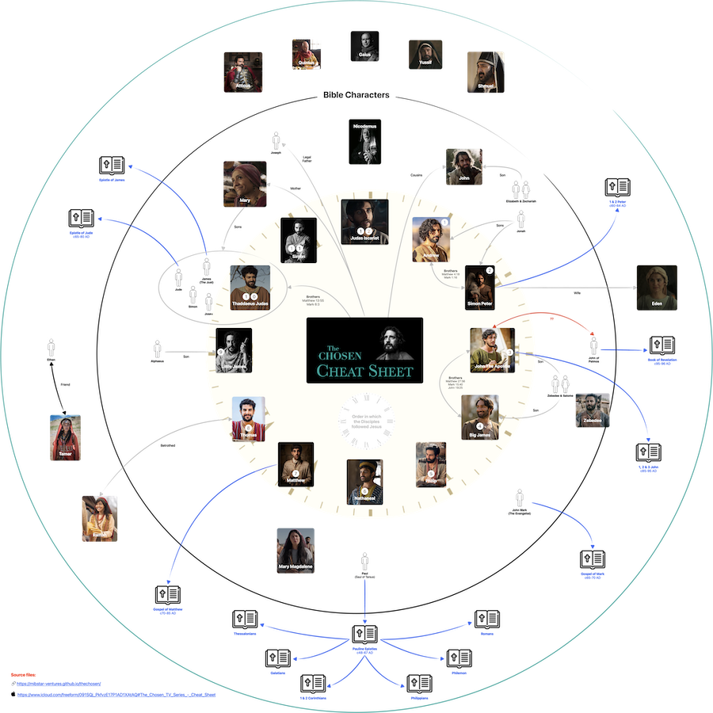

The Chosen [www.thechosen.tv](http://www.thechosen.tv) is a historical drama that was first released in 2017 and is now in its fifth season. The series has gained significant popularity and critical acclaim for its depiction of the life and ministry of Jesus Christ and the impact on his followers.

**Influence of Media on Beliefs**

Media has a profound influence on our understanding and beliefs. From Charlton Heston's iconic portrayal of Moses in the 1956 film *"The Ten Commandments"*, which shaped many people's perceptions of the character and storyline, to Russell Crowe's interpretation of Noah in the 2014 film *"Noah"*, media interpretations can deeply affect how we relate to biblical narratives and characters.

**Purpose of This Project**

The purpose of this project is to help manage and contextualise the influence of media on our beliefs, especially in relation to religious and historical dramas. 

We hope this becomes a place where we can separate biblical text from creative licence without de-meriting the latter. 

## Overarching Objectives

To achieve this, we have set the following overarching objectives:

<table><thead><tr>
  <th>As A</th>
  <th>I want</th>
  <th>So that</th>
</tr></thead>
<tbody><tr>
  <td data-label="As A "   > Watcher</td>
  <td data-label="I want " > to know what is biblically based</td>
  <td data-label="So that "> I can separate bible based from artistic license</td>
</tr><tr>
  <td data-label="As A "   >Watcher</td>
  <td data-label="I want" >to read or study the stories from their sources</td>
  <td data-label="So that">I gain my own understanding or interpretation</td>
</tr><tr>
  <td data-label="As A"   >Visual Learner</td>
  <td data-label="I want" >to have a cheat sheet or reference material</td>
  <td data-label="So that">I can connect my existing knowledge to the story being presented</td>
</tr><tr>
  <td data-label="As A "   >Fan</td>
  <td data-label="I want " >to use the series as a modern teaching material</td>
  <td data-label="So that ">others may learn</td>
</tr><tr>
  <td data-label="As A "   >Fan</td>
  <td data-label="I want " >to document the characters, stories and facts</td>
  <td data-label="So that ">I can distinguish historical facts from artistic license</td>
</tr><tr>
  <td data-label="As A "   >Critical Thinker / Questioner</td>
  <td data-label="I want " >evaluate my own or inherited beliefs</td>
  <td data-label="So that ">I can deepen or come up with my own personal beliefs</td>
</tr></tbody></table>

## Table of Contents

 * [**Cheet Sheet**](#cheat-sheet) 
 * [**Characters**](characters/)
   * [The 12 Disciples](characters/#the-12-disciples-of-jesus)
   * [Biblical Characters](characters/#biblical-characters)
   * [Non-Biblical Characters](characters/#non-biblical-characters)

## Cheat Sheet

**Other formats:**

 * [PDF 24Mb](cheat-sheet/PDF.pdf)
 * [Large Image 10Mb](cheat-sheet/image.png)
 *  [Freeform board (source file)](https://www.icloud.com/freeform/091SQj_PkfvzE17P1AD1XAtAQ#The_Chosen_TV_Series_-_Cheat_Sheet)

## Open Source Repository

This website is generated from the [mibstar-ventures/thechosen](https://github.com/mibstar-ventures/thechosen) GitHub repository.

## Creators

[mibstar.co.uk](https://www.mibstar.co.uk)

