

The Chosen [www.thechosen.tv](https://www.thechosen.tv) is a historical drama which was first released in 2017 and is now in Season 5 of the series. 

As is with many cases, media can have a strong influence in our understanding and even beliefs. Wether that be Charlton Heston gaining stardom in Moses in 1956 and how we may relate to the character and storyline or a recent interpretation of Noah by Russel Crowe. 

The purpose of this project is to help us manage that and the initial and over-arching objectives are the following:

## Overarching Objectives

| As s  | I want | So that | 
| :--: | ------- | ------- |
| Watcher | to know what is biblically based | I can separate bible based from artistic license |
| Watcher | to read or study the stories from their sources | I gain my own understanding or interpretation |
| Visual learner | to have a cheat sheet or reference material | I can connect my existing knowledge to the story being presented |
| Fan | to use the series as a modern teaching material | others may learn |
| Fan | to document the characters, stories and facts | I can distinguish historical facts from artistic license |
| Critical Thinker / Questioner | evaluate my own or inherited beliefs | I ican deepen or come up with my own personal beliefs |

## Characters
### The 12 Disciples of Jesus

| Photo | Names & Relationships | Notes | Approx. Order of Following Jesus |
| :--: | ------------- | ----- | :--: |
| 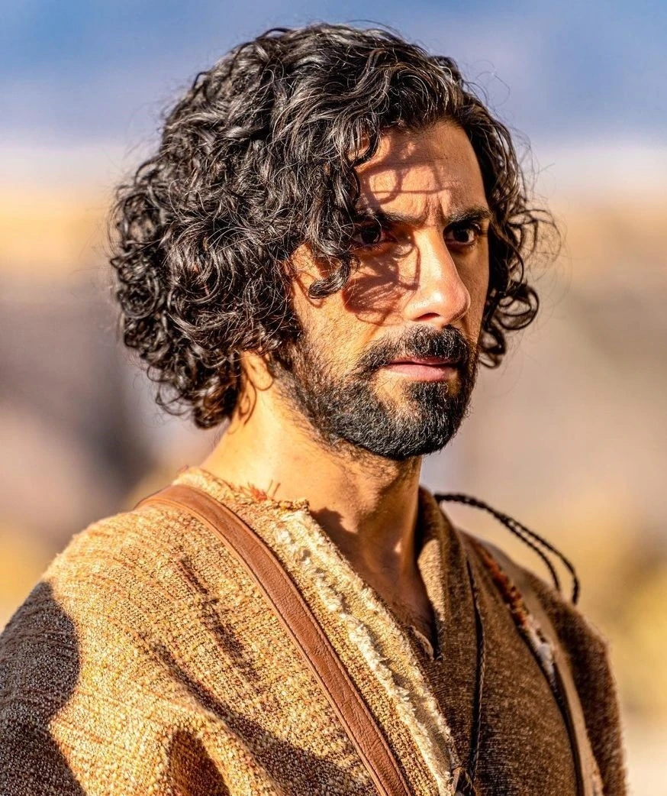  | **Andrew**    Brother of Peter & son of Jonah | One of the first disciples called. | 1 |
|   | **Peter** (Simon)    Brother of Andrew & son of Jonah | One of the first disciples called. | 2 |
| 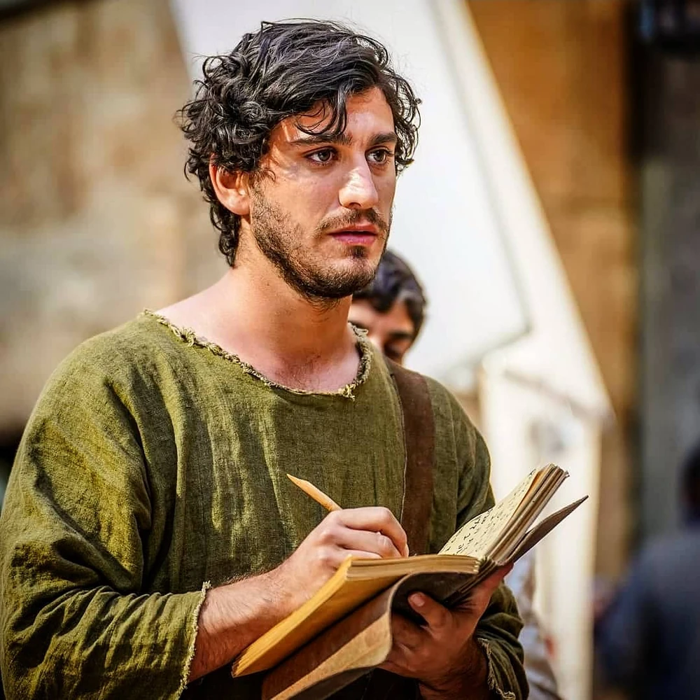  | **John**   (The Apostle)    Brother of James | Part of the inner circle of disciples. | 3 | 
|   | (Big)   **James**   Brother of John | Part of the inner circle of disciples. | 4 | 
| 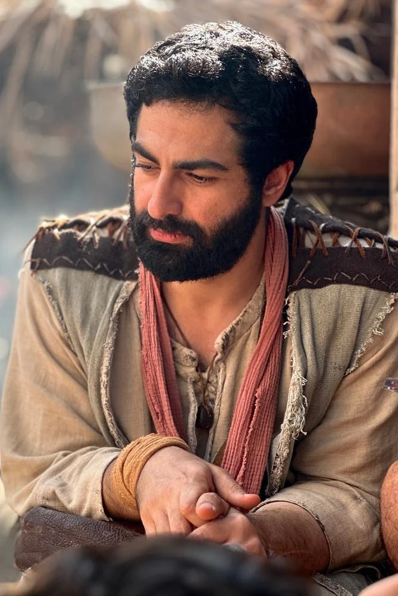 | **Philip** | From Bethsaida, brought Nathanael to Jesus. | 5 | 
| 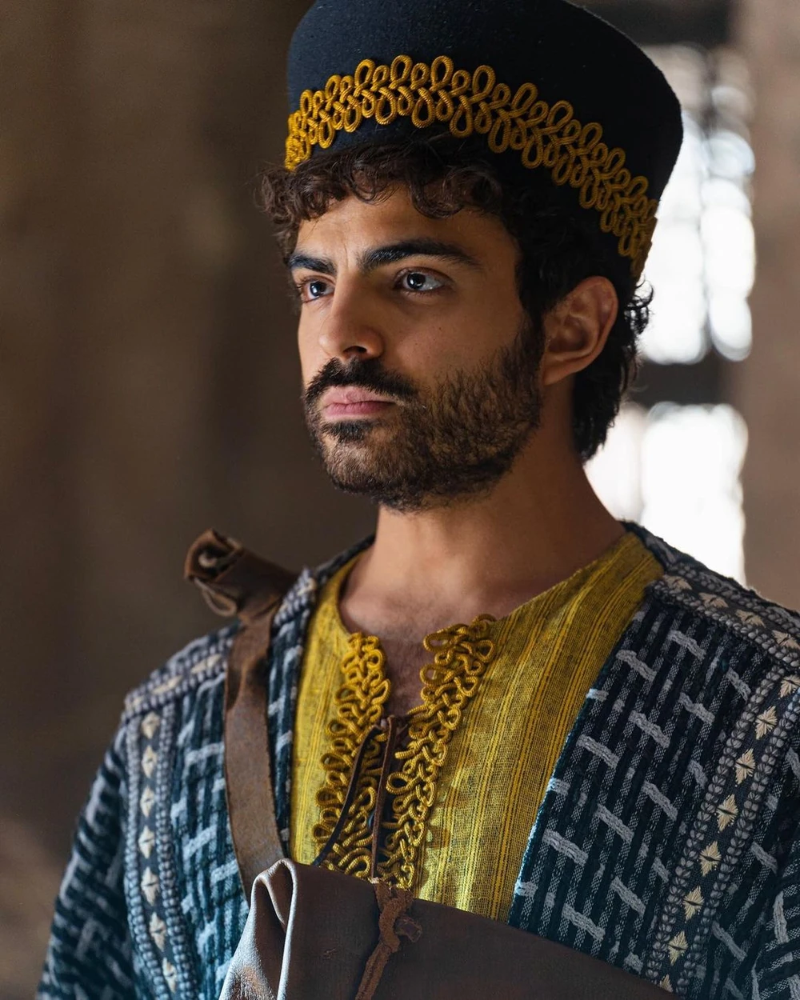 | **Nathanael**   (Bartholomew) | Brought to Jesus by Philip. | 6 | 
|  | **Matthew**   (Levi)| Tax collector before being called by Jesus. | 7 | 
|  | **Thomas** | Often referred to as _"Doubting Thomas"_ | 8 | 
| 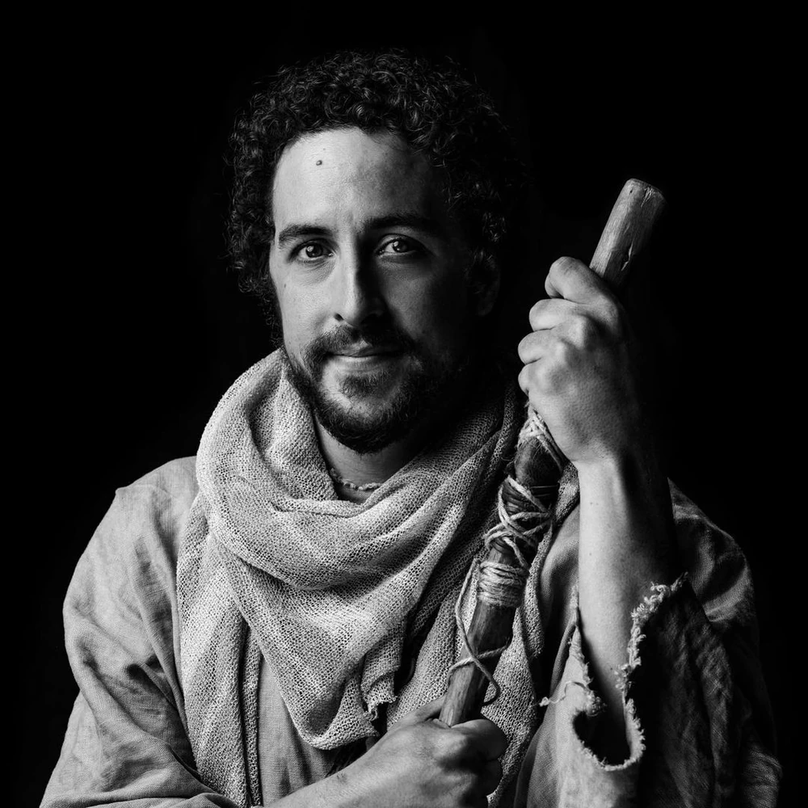 | (Little)   **James**    The son of Alphaeus | Mentioned in the lists of disciples but has no specific call narrative. | 9 | 
| 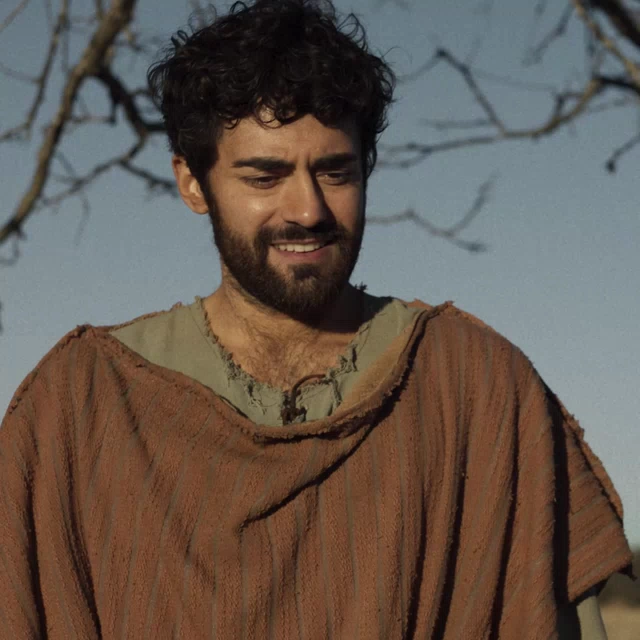| **Thaddeus**   (Lebbaeus) | Mentioned in the lists of disciples but has no specific call narrative. | 10 | 
|  | **Simon**   (The Zealot)| Mentioned in the lists of disciples but has no specific call narrative. | 11 | 
|  | **Judas Iscariot** |The disciple who betrayed Jesus. | 12 |

### Biblical Characters

| Photo | Names & Relationships | Notes | 
| :--: | ------------- | ----- |
| 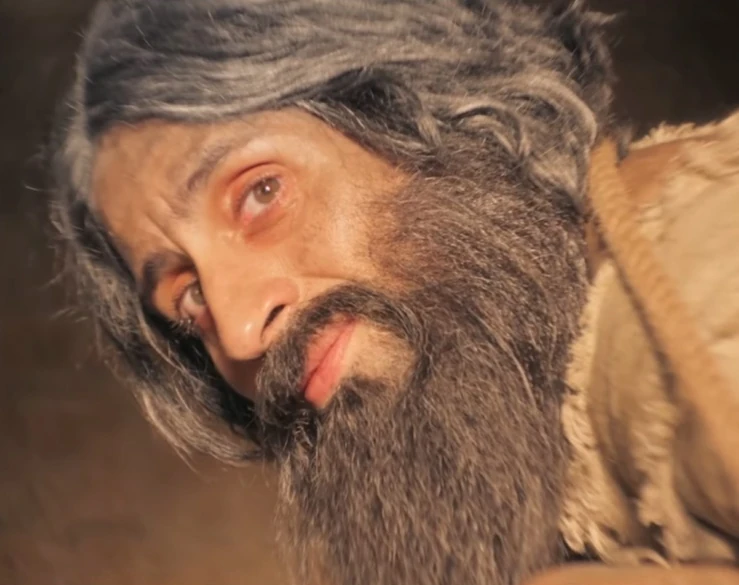  | **John**  (The Baptist)    Son of Elizabeth & Zechariah | Cousin of Jesus | 
| 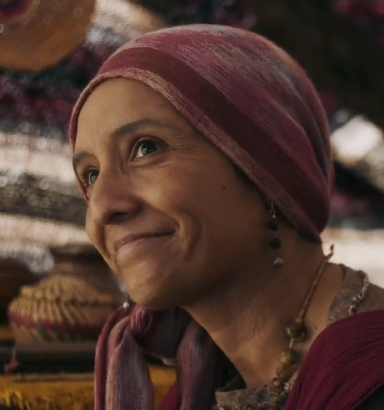  | **Mary**    Mother of Jesus  | Mother of Thaddaeus Judas, Joses, Simon, Jude & James (The Just) |
| 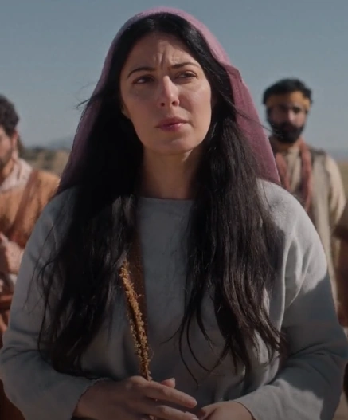  | **Mary Magdalene** | A redeemed formerly demon-possessed woman from Magdala and one of the women helping Jesus's ministry. |

### Non-Biblical Characters

Characters from the series which are not mentioned in the Bible.

| Photo | Names & Relationships | Notes | 
| :--: | ------------- | ----- |
| 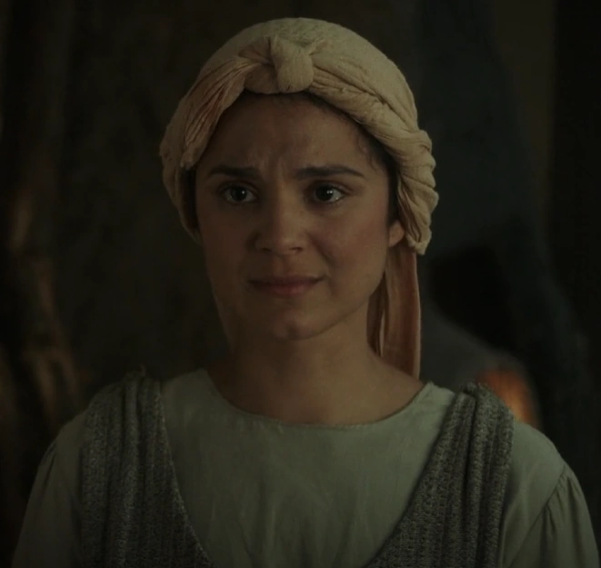  | **Eden**    Wife of Peter (Simon) | One of the women helping Jesus's ministry. | 
|   | **Ramah**    Betrothed to Thomas  | The daughter of Dasha, and one of the women helping Jesus's ministry.  |
| 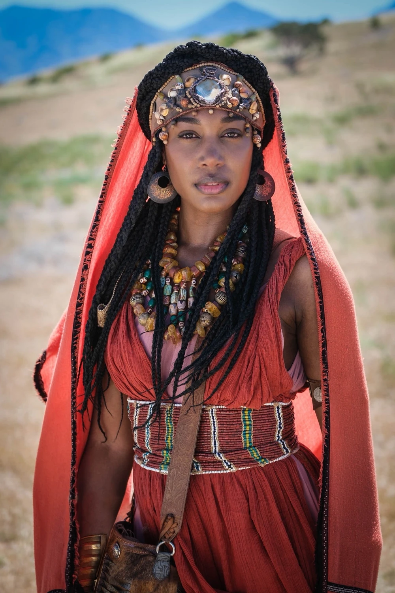  | **Tamar** | An Ethiopian friend of Ethan, the healed paralytic in Capernaum, from Heliopolis, and one of the women helping Jesus's ministry. |

---

## Open Source Repository

This website is generated from the [mibstar-ventures/thechosen](https://github.com/mibstar-ventures/thechosen) GitHub repository.

## Creators

[mibstar.co.uk](https://www.mibstar.co.uk)

## License

This work is licensed under <a href="https://creativecommons.org/licenses/by-nc/4.0/?ref=chooser-v1" target="_blank" rel="license noopener noreferrer" style="display:inline-block;">Creative Commons Attribution-NonCommercial 4.0 International</a>
