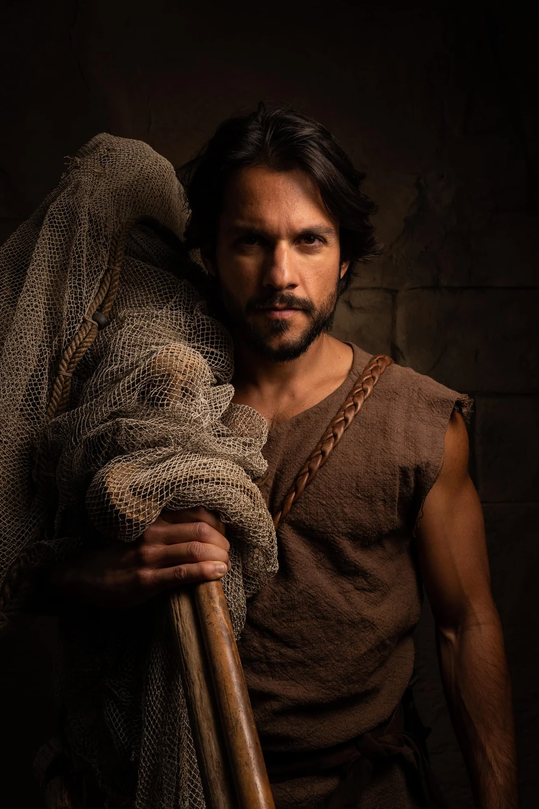
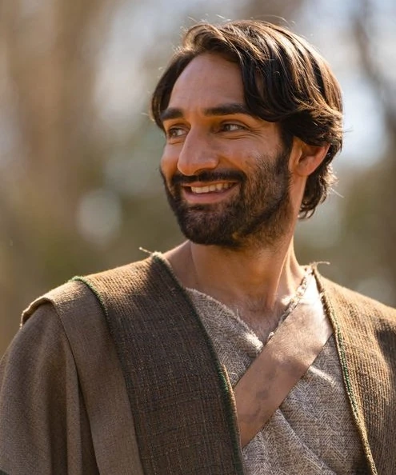
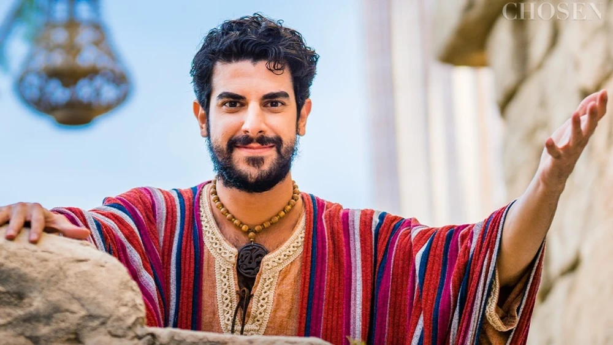
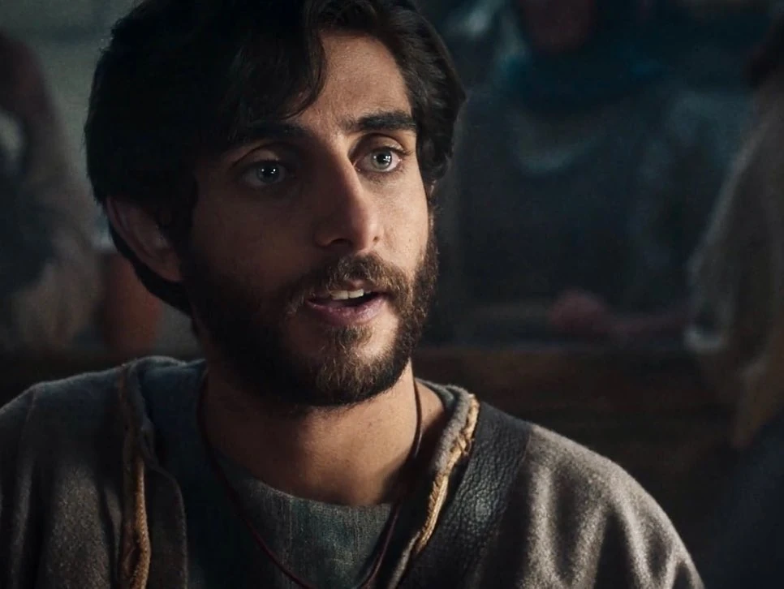

The Chosen [www.thechosen.tv](http://www.thechosen.tv) is a historical drama that was first released in 2017 and is now in its fifth season. The series has gained significant popularity and critical acclaim for its depiction of the life and ministry of Jesus Christ and the impact on his followers.

**Influence of Media on Beliefs**

Media has a profound influence on our understanding and beliefs. From Charlton Heston's iconic portrayal of Moses in the 1956 film *"The Ten Commandments"*, which shaped many people's perceptions of the character and storyline, to Russell Crowe's interpretation of Noah in the 2014 film *"Noah"*, media interpretations can deeply affect how we relate to biblical narratives and characters.

**Purpose of This Project**

The purpose of this project is to help manage and contextualise the influence of media on our beliefs, especially in relation to religious and historical dramas. 

We hope this becomes a place where we can separate biblical text from creative licence without de-meriting the latter. 

## Overarching Objectives

To achieve this, we have set the following overarching objectives:

| As s  | I want | So that | 
| :---: | ------ | ------- |
| Watcher | to know what is biblically based | I can separate bible based from artistic license |
| Watcher | to read or study the stories from their sources | I gain my own understanding or interpretation |
| Visual learner | to have a cheat sheet or reference material | I can connect my existing knowledge to the story being presented |
| Fan | to use the series as a modern teaching material | others may learn |
| Fan | to document the characters, stories and facts | I can distinguish historical facts from artistic license |
| Critical Thinker / Questioner | evaluate my own or inherited beliefs | I can deepen or come up with my own personal beliefs |

## Table of Contents

 * [**Cheet Sheet**](#cheat-sheet) 
 * [**Characters**](#characters)
   * [The 12 Disciples](#the-12-discicple-of-jesus)
   * [Biblical Characters](#biblical-characters)
   * [Non-Biblical Characters](#non-biblical-characters)

## Cheat Sheet

**Other formats:**

 * [PDF](cheat-sheet/PDF.pdf)
 * [Large Image](cheat-sheet/image.png)
 *  [Freeform source board](https://www.icloud.com/freeform/091SQj_PkfvzE17P1AD1XAtAQ#The_Chosen_TV_Series_-_Cheat_Sheet)

## Characters
### The 12 Disciples of Jesus

| Names & Relationships | Notes | Photo | Order of   Following Jesus   (Approx) |
| :-------------------- | :---- | :---: | :------------------------------: |
| **Andrew**    Brother of Peter & son of Jonah | One of the first disciples called. |  | 1 |
| **Peter** (Simon)    Brother of Andrew & son of Jonah | One of the first disciples called. |  | 2 |
| **John**   (The Apostle)    Brother of James | Part of the inner circle of disciples. |  | 3 |
| (Big) **James**   Brother of John | Part of the inner circle of disciples. |  | 4 |
| **Philip** | From Bethsaida, brought Nathanael to Jesus. |  | 5 |
| **Nathanael**   (Bartholomew) | Brought to Jesus by Philip. |  | 6 |
| **Matthew**   (Levi) | Tax collector before being called by Jesus. |  | 7 |
| **Thomas** | Often referred to as _"Doubting Thomas"_. |  | 8 |
| (Little) **James**    The son of Alphaeus | Mentioned in the lists of disciples but has no specific call narrative. |  | 9 |
| **Thaddeus**   (Lebbaeus) | Mentioned in the lists of disciples but has no specific call narrative. |  | 10 |
| **Simon**   (The Zealot) | Mentioned in the lists of disciples but has no specific call narrative. |  | 11 |
| **Judas Iscariot** | The disciple who betrayed Jesus. |  | 12 |

### Biblical Characters

| Names & Relationships | Notes | Photo |
| --------------------- | ----- | :---: |
| **John**  (The Baptist)    Son of Elizabeth & Zechariah | Cousin of Jesus. |  |
| **Mary**    Mother of Jesus | Mother of Thaddaeus Judas, Joses, Simon, Jude & James (The Just). |  |
| **Mary Magdalene** | A redeemed formerly demon-possessed woman from Magdala and one of the women helping Jesus's ministry. |  |
| **Nicodemus** | Leading Pharisee from Jerusalem, a respected rabbi, and a high-ranking member of the Sanhedrin. He is a secret disciple of Jesus. |  |
| **Zebedee**     Husband of Salome. Father of James & John | He is described as a fisherman and a businessman who operated a fishing business on the Sea of Galilee. Zebedee's wife is identified as Salome, and together they had two sons, James and John, who became prominent disciples of Jesus. |  |
| **Salome**   Wife of Zebedee. Mother of James & John | She is mentioned in the context of Jesus' ministry and the events surrounding his crucifixion. Salome is also present at the crucifixion of Jesus, along with other women who were followers of Jesus. |  |

### Non-Biblical Characters

Characters from the series which are not mentioned in the Bible.

| Names & Relationships | Notes | Photo |
| --------------------- | ----- | :---: |
| **Eden**    Wife of Peter (Simon) | One of the women helping Jesus's ministry. |  |
| **Ramah**    Betrothed to Thomas | The daughter of Dasha, and one of the women helping Jesus's ministry. |  |
| **Tamar** | An Ethiopian friend of Ethan, the healed paralytic in Capernaum, from Heliopolis, and one of the women helping Jesus's ministry. |  |
| **Atticus** | One of the Roman cohortes urbanae sent from Rome to investigate the Zealots and then Jesus. |   |
| **Yussif** | A leading Pharisee from Jerusalem, a respected rabbi, and a high-ranking member of the Sanhedrin. He is a secret disciple of Jesus. |  |
| **Shmuel** | A leading Pharisee from Capernaum and a member of the Sanhedrin |  |
| **Quintus** | A former Roman magistrate in Capernaum and the former Praetor of Galilee. |  |
| **Gaius** | A Roman centurion. |  |

## Open Source Repository

This website is generated from the [mibstar-ventures/thechosen](https://github.com/mibstar-ventures/thechosen) GitHub repository.

## Creators

[mibstar.co.uk](https://www.mibstar.co.uk)

## License

This work is licensed under <a href="https://creativecommons.org/licenses/by-nc/4.0/?ref=chooser-v1" target="_blank" rel="license noopener noreferrer" style="display:inline-block;">Creative Commons Attribution-NonCommercial 4.0 International</a>
