## Characters 
### The 12 Disciples of Jesus

| Names & Relationships | Notes | Photo | Order of   Following Jesus   (Approx) |
| :-------------------- | :---- | :---: | :------------------------------: |
| **Andrew**    Brother of Peter & son of Jonah | One of the first disciples called. |  | 1 |
| **Peter** (Simon)    Brother of Andrew & son of Jonah | One of the first disciples called. | [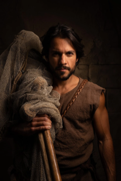](images/Simon_Peter.webp) | 2 |
| **John**   (The Apostle)    Brother of James | Part of the inner circle of disciples. |  | 3 |
| (Big) **James**   Brother of John | Part of the inner circle of disciples. | [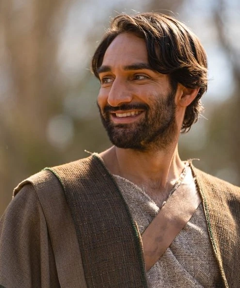](images/Big_James.webp) | 4 |
| **Philip** | From Bethsaida, brought Nathanael to Jesus. | [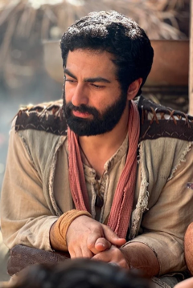](images/Philip.webp) | 5 |
| **Nathanael**   (Bartholomew) | Brought to Jesus by Philip. |  | 6 |
| **Matthew**   (Levi) | Tax collector before being called by Jesus. | [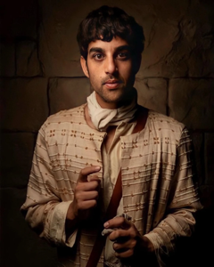](images/Matthew.webp) | 7 |
| **Thomas** | Often referred to as _"Doubting Thomas"_. |  | 8 |
| (Little) **James**    The son of Alphaeus | Mentioned in the lists of disciples but has no specific call narrative. |  | 9 |
| **Thaddeus**   (Lebbaeus) | Mentioned in the lists of disciples but has no specific call narrative. |  | 10 |
| **Simon**   (The Zealot) | Mentioned in the lists of disciples but has no specific call narrative. | [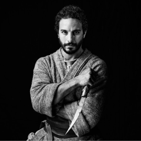](images/Simon_Z.webp) | 11 |
| **Judas Iscariot** | The disciple who betrayed Jesus. |  | 12 |

### Biblical Characters

| Names & Relationships | Notes | Photo |
| --------------------- | ----- | :---: |
| **John**  (The Baptist)    Son of Elizabeth & Zechariah | Cousin of Jesus. |  |
| **Mary**    Mother of Jesus | Mother of Thaddaeus Judas, Joses, Simon, Jude & James (The Just). |  |
| **Mary Magdalene** | A redeemed formerly demon-possessed woman from Magdala and one of the women helping Jesus's ministry. | [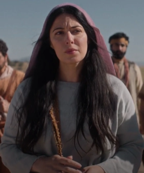](images/Mary_Magdalene.webp) |
| **Nicodemus** | Leading Pharisee from Jerusalem, a respected rabbi, and a high-ranking member of the Sanhedrin. He is a secret disciple of Jesus. | [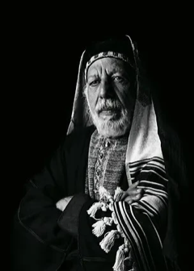](images/Nicodemus.webp) |
| **Zebedee**     Husband of Salome. Father of James & John | He is described as a fisherman and a businessman who operated a fishing business on the Sea of Galilee. Zebedee's wife is identified as Salome, and together they had two sons, James and John, who became prominent disciples of Jesus. |  |
| **Salome**   Wife of Zebedee. Mother of James & John | She is mentioned in the context of Jesus' ministry and the events surrounding his crucifixion. Salome is also present at the crucifixion of Jesus, along with other women who were followers of Jesus. |  |

### Non-Biblical Characters

Characters from the series which are not mentioned in the Bible.

| Names & Relationships | Notes | Photo |
| --------------------- | ----- | :---: |
| **Eden**    Wife of Peter (Simon) | One of the women helping Jesus's ministry. | [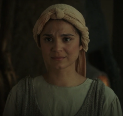](images/Eden.webp) |
| **Ramah**    Betrothed to Thomas | The daughter of Dasha, and one of the women helping Jesus's ministry. |  |
| **Tamar** | An Ethiopian friend of Ethan, the healed paralytic in Capernaum, from Heliopolis, and one of the women helping Jesus's ministry. | [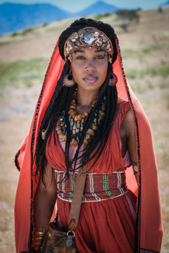](images/Tamar.webp) |
| **Atticus** | One of the Roman cohortes urbanae sent from Rome to investigate the Zealots and then Jesus. |  [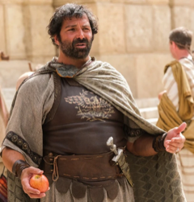](images/Atticus.webp) |
| **Yussif** | A leading Pharisee from Jerusalem, a respected rabbi, and a high-ranking member of the Sanhedrin. He is a secret disciple of Jesus. | [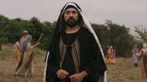](images/Yussif.webp) |
| **Shmuel** | A leading Pharisee from Capernaum and a member of the Sanhedrin | [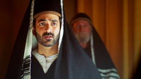](images/Shmuel.webp) |
| **Quintus** | A former Roman magistrate in Capernaum and the former Praetor of Galilee. | [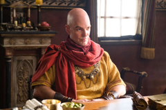](images/Quintus.webp) |
| **Gaius** | A Roman centurion. | [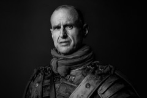](images/Gaius.jpg) |
